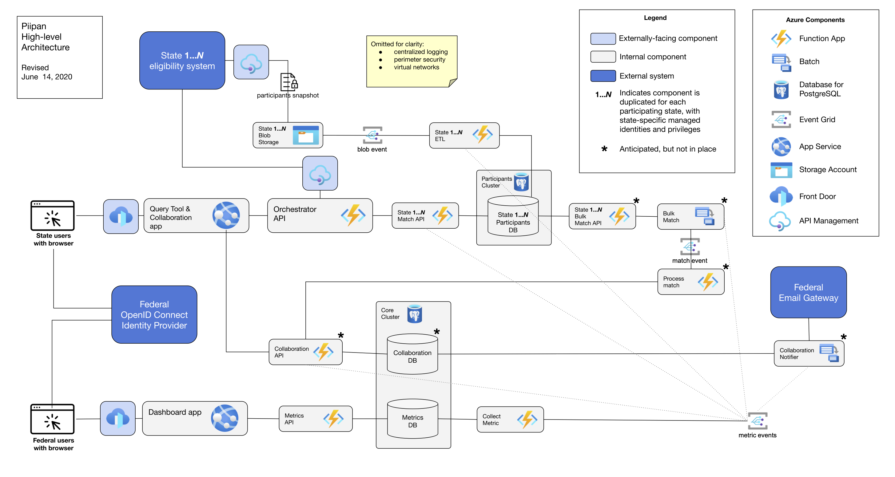

[![Build Status][badge_ci]][1] [![Maintainability][badge_cc_maint]][2] [![Test Coverage][badge_cc_cov]][3]

# piipan

*A system for storing and matching Personal Identifiable Information (PII) records.*

Piipan is a reference model for program integrity initiatives that aim to prevent multiple enrollment in federally-funded, but state-managed benefit programs. Under this model, each state regularly submits their entire list of program participants (i.e., their unique PII) to a federally run instance of Piipan. State-level eligibility workers for the benefit program then query Piipan as part of their (re)certification process; if the applicant is found to be receiving benefits in another state, the eligibility worker deconflicts the multiple enrollment.

Paramount quality attributes of this system include:
* Only collect PII data elements that are strictly required
* Confidentiality of program participant information
* Accuracy of matches
* Adaptability to policy changes and multiple benefit programs

Further, this reference model is motivated and guided by [Sec. 4011 of the 2018 Farm Bill](https://www.congress.gov/bill/115th-congress/house-bill/2/text), *Interstate data matching to prevent multiple issuances*, which mandates that the information made available by state agencies:
* shall be used only for the purpose of preventing multiple enrollment;
* shall not be retained for longer than is necessary.

## High-level architecture

Piipan is designed to be a cloud-native system. It is under active development and is not complete. Several subsystems are anticipated and partially implemented:

* [Extract-Transform-Load (ETL)](./etl)
* [Active Match Orchestrator API](./match)
* [Query Tool & Collaboration app](./query-tool)
* [Dashboard app](./dashboard)
* Batch-driven Passive Match
 
A diagram depicting these anticipated subsystems is below:

  

A guiding architectural principle is to treat state agencies and their data as tenants of a platform (i.e., Piipan), and accordingly apply isolation best practices and the principle of least privilege throughout the system.

Finally, this reference model is designed to be extended to support a fully federated system, whereby PII records never leave state-run enclaves in bulk. Under this hypothetical extension, the federally-run API orchestrator would reach back to each state, rather than its own isolated copies of state participant records. And the passive match API would incorporate a Privacy Set Intersection (PSI) protocol, with the federal system acting as a semi-trusted 3rd party. 

## Implementation

Piipan targets Microsoft Azure as its cloud computing platform, but generally selects for commoditized features that are available on other cloud platforms.

To expedite development and compliance processes, Piipan maximizes the use of managed services, including Function-as-a-Service (FaaS). No virtual machines or containers are directly employed in the production system.

Piipan's programming languages and frameworks include: .NET Core, C#, and ASP.NET using Razor Pages. Bash and ARM templates are used for Infrastructure-as-Code.

Our processes and code are intended to be platform agnostic: the 18F team primarily uses macOS-hosted local development tools and the managed services use a mix of Windows and Linux.

Piipan uses the monorepo strategy; subsystems get their own top-level directory and are independently deployable modulo any shared datastores. A system-wide CircleCI configuration manages continuous integration and deployment.

## Documentation

Process and (sub)system documentation, as well as Architectural Decision Records (ADRs), are organized in [this index](./docs/README.md).

## Public domain

This project is in the worldwide [public domain](LICENSE.md). As stated in [CONTRIBUTING](CONTRIBUTING.md):

> This project is in the public domain within the United States, and copyright
> and related rights in the work worldwide are waived through the [CC0 1.0
> Universal public domain
> dedication](https://creativecommons.org/publicdomain/zero/1.0/).
>
> All contributions to this project will be released under the CC0
>dedication. By submitting a pull request, you are agreeing to comply
>with this waiver of copyright interest.

[badge_ci]: https://circleci.com/gh/18F/piipan.svg?style=shield
[badge_cc_maint]: https://api.codeclimate.com/v1/badges/e14b8f6ac1f5a8e0f5bf/maintainability
[badge_cc_cov]: https://api.codeclimate.com/v1/badges/e14b8f6ac1f5a8e0f5bf/test_coverage
[1]: https://circleci.com/gh/18F/piipan
[2]: https://codeclimate.com/github/18F/piipan/maintainability
[3]: https://codeclimate.com/github/18F/piipan/test_coverage
